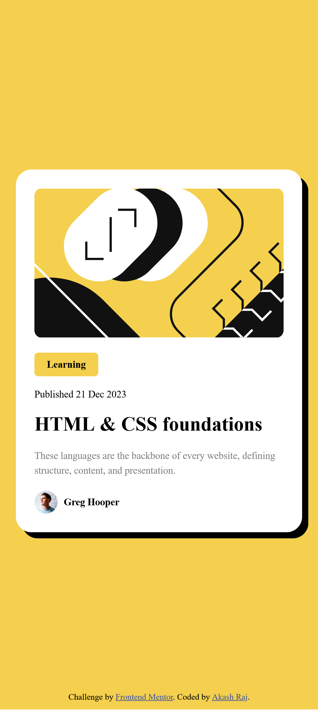
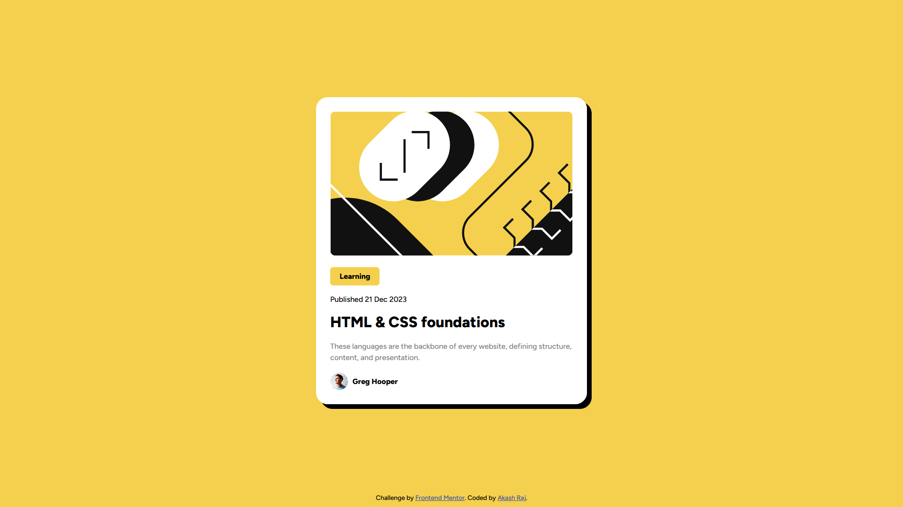

# Frontend Mentor - Blog preview card solution

This is a solution to the [Blog preview card challenge on Frontend Mentor](https://www.frontendmentor.io/challenges/blog-preview-card-ckPaj01IcS). Frontend Mentor challenges help you improve your coding skills by building realistic projects. 

## Table of contents

- [Overview](#overview)
  - [The challenge](#the-challenge)
  - [Screenshot](#screenshot)
  - [Links](#links)
- [My process](#my-process)
  - [Built with](#built-with)
- [Author](#author)
- [Acknowledgments](#acknowledgments)

## Overview

### The challenge

Users should be able to:

- See hover and focus states for all interactive elements on the page

### Screenshot

 

### Links

- [Solution URL](https://github.com/rshakash/frontend_mentor/tree/main/blog-preview-card)
- [Live Site URL](https://rshakash.github.io/frontend_mentor/blog-preview-card/index.html)

## My process

### Built with

- Semantic HTML5 markup
- CSS custom properties
- Flexbox

## Author

- Website - [Akash Raj](https://www.rshakash.github.io)
- Frontend Mentor - [@rshakash](https://www.frontendmentor.io/profile/rshakash)

